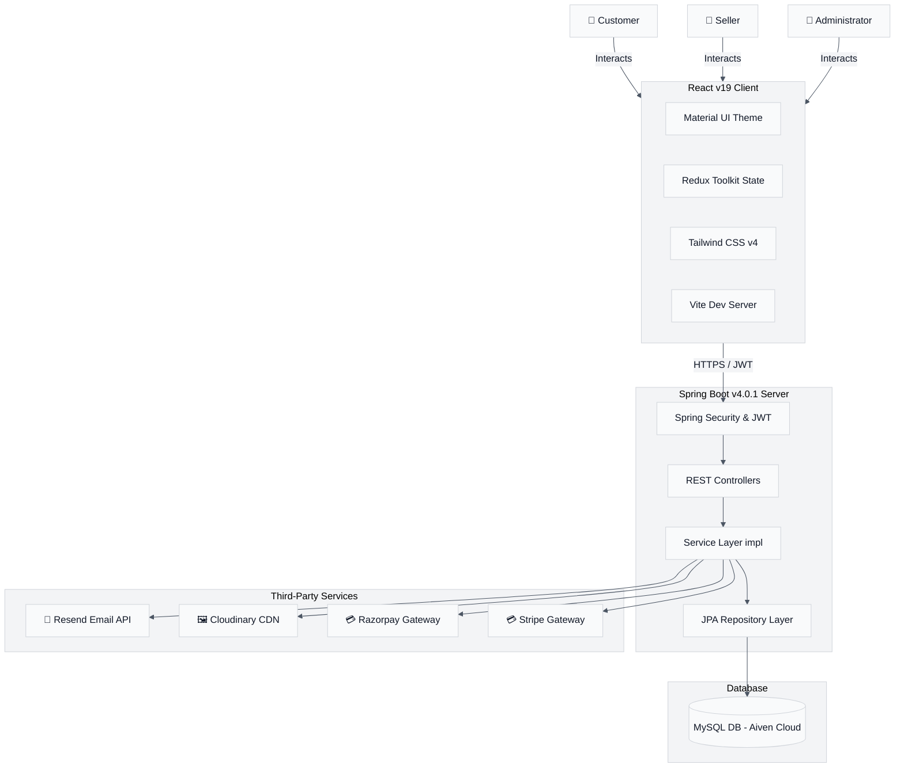
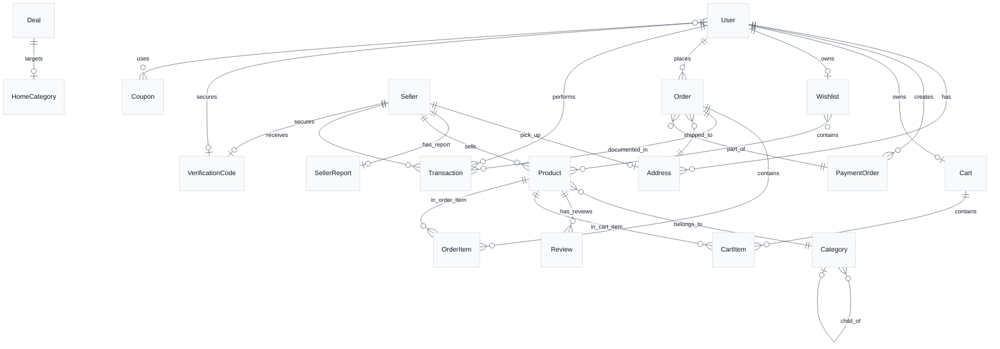

# 🛍️ Market - Multi-Vendor E-Commerce Marketplace

Market is a modern, enterprise-grade, multi-vendor e-commerce platform designed to bridge the gap between customers, sellers, and platform administrators. Built with a scalable micro-monolith architecture, it features a robust **Spring Boot** backend, an interactive and responsive **React** + **TypeScript** frontend, and a high-integrity **MySQL** relational database.

---

## 🏗️ System Architecture

The following diagram illustrates how the system's core actors (Customers, Sellers, Admins) interact with the frontend, the backend services, database, and third-party integrations:



---

## 🛠️ Technology Stack

### Backend (Core Services)
*   **Language & Runtime:** Java 21
*   **Framework:** Spring Boot 4.0.1
*   **Database Access:** Spring Data JPA (Hibernate ORM)
*   **Security & Auth:** Spring Security with stateless JWT (`jjwt` 0.11.5) & BCrypt password hashing
*   **validation:** Spring Validation starter (`jakarta.validation`)
*   **Third-Party Integrations:**
    *   **Payments:** Razorpay API (`razorpay-java` 1.4.7) & Stripe SDK (`stripe-java` 31.1.0)
    *   **Cloud Storage:** Cloudinary SDK (`cloudinary-http44` 1.36.0) for product images and seller logo/banners
    *   **Communications:** Resend API for sending transactional email alerts and OTPs
*   **Database:** MySQL (Hosted on Aiven Cloud)

### Frontend (Client Application)
*   **Build Tool & Dev Server:** Vite 7.2.4
*   **Libraries:** React 19.2.0 & React DOM 19.2.0
*   **Language:** TypeScript
*   **State Management:** Redux Toolkit 2.11.2 (with Redux Thunk asynchronous actions)
*   **UI & Component Library:** Material UI (MUI 7.3.6) + Emotion Styled Components
*   **Styling:** Tailwind CSS v4.1.18 (configured via `@tailwindcss/vite`)
*   **Form Management:** Formik 2.4.9 & Yup 1.7.1 for validations
*   **Networking:** Axios 1.13.3
*   **Utilities:** React Slick (carousel components), DayJS (date formatting)

---

## 🗄️ Database Schema & Entity Relationships

The application enforces strong data integrity constraints. The database holds 16 tables mapped through JPA annotations.

### Entity Relationship Diagram (ERD)



### Table Schema Definitions

#### 1. `User`
Stores client/customer information and general platform accounts.
*   `id` (BIGINT, PK): Auto-incremented primary key.
*   `password` (VARCHAR, Write-Only): Encrypted password hash.
*   `email` (VARCHAR, Unique): Login credential.
*   `fullName` (VARCHAR): User's full name.
*   `mobile` (VARCHAR): Contact number.
*   `role` (ENUM): User authorization level (`ROLE_CUSTOMER`, `ROLE_SELLER`, `ROLE_ADMIN`). Default is `ROLE_CUSTOMER`.
*   **Relationships:**
    *   `addresses` (One-to-Many): List of saved shipping addresses (Cascade All, Orphan Removal).
    *   `usedCoupons` (Many-to-Many): Coupons used by the user, mapped via joint table `user_used_coupons`.

#### 2. `Seller`
Stores seller-specific details, onboarding verification status, and business parameters.
*   `id` (BIGINT, PK): Primary key.
*   `sellerName` (VARCHAR): Business or seller public name.
*   `mobile` (VARCHAR): Business contact number.
*   `email` (VARCHAR, Unique, Not Null): Seller account login email.
*   `password` (VARCHAR, Write-Only): Encrypted password.
*   `GSTIN` (VARCHAR): Goods and Services Tax Identification Number.
*   `isEmailVerified` (BOOLEAN): Defaults to `false`.
*   `accountStatus` (ENUM): Onboarding state (`PENDING_VERIFICATION`, `ACTIVE`, `SUSPENDED`, `DEACTIVATED`).
*   **Embedded Schemas:**
    *   `businessDetails`: Contains `businessName`, `businessEmail`, `businessMobile`, `businessAddress`, `logo`, `banner`.
    *   `bankDetails`: Contains `accountNumber`, `accountHolderName`, `ifscCode`.
*   **Relationships:**
    *   `pickupAddress` (One-to-One): Direct link to `Address` entity.

#### 3. `Address`
Re-usable model representing shipping or seller warehouse/pickup addresses.
*   `id` (BIGINT, PK): Primary key.
*   `name` (VARCHAR): Receiver name.
*   `locality` (VARCHAR): Neighborhood/street locality.
*   `address` (VARCHAR): Main street details.
*   `city` (VARCHAR) / `state` (VARCHAR)
*   `pinCode` (VARCHAR): Postal code.
*   `mobile` (VARCHAR): Contact number for shipping updates.
*   **Relationships:**
    *   `user` (Many-to-One): Back-reference to the owner (User).

#### 4. `Product`
The items offered for sale on the platform.
*   `id` (BIGINT, PK): Primary key.
*   `title` (VARCHAR): Product title.
*   `description` (TEXT): Rich text description.
*   `mrpPrice` (INT): Manufacturer's Suggested Retail Price.
*   `sellingPrice` (INT): Actual price listed on the market.
*   `discountPercent` (INT): Calculated discount percentage.
*   `quantity` (INT): Available warehouse stock.
*   `color` (VARCHAR): Product color.
*   `sizes` (VARCHAR): Comma-separated list of sizes (e.g., `"S,M,L,XL"`).
*   `images` (Element Collection): Mapped as a nested table of image URLs (Batch fetched for performance).
*   `numRatings` (INT): Total reviews received.
*   `createdAt` (TIMESTAMP): Date of listing creation.
*   **Relationships:**
    *   `category` (Many-to-One): Links to a specific category.
    *   `seller` (Many-to-One): Links to the owner (Seller).
    *   `reviews` (One-to-Many): Back-reference to user reviews.

#### 5. `Category`
Hierarchical tree representing catalog classifications.
*   `id` (BIGINT, PK): Primary key.
*   `name` (VARCHAR): User-friendly display name.
*   `categoryId` (VARCHAR, Unique, Not Null): Alphanumeric code identifier.
*   `level` (INT, Not Null): Depth level in the category tree (e.g., Level 1: Main Category, Level 2: Sub-category, Level 3: Leaf-category).
*   **Relationships:**
    *   `parentCategory` (Many-to-One): Self-referential link pointing to parent node.

#### 6. `Cart` & `CartItem`
Maintains customer products awaiting checkout.
*   `Cart`:
    *   `id` (BIGINT, PK): Primary key.
    *   `totalSellingPrice` (DOUBLE), `totalItem` (INT), `totalMrpPrice` (INT), `discount` (INT).
    *   `couponCode` (VARCHAR): Applied coupon.
    *   **Relationships:**
        *   `user` (One-to-One): Links to owner.
        *   `cartItems` (One-to-Many): List of active cart lines.
*   `CartItem`:
    *   `id` (BIGINT, PK): Primary key.
    *   `size` (VARCHAR), `quantity` (INT), `mrpPrice` (INT), `sellingPrice` (INT), `userId` (BIGINT).
    *   **Relationships:**
        *   `cart` (Many-to-One): Owner cart.
        *   `product` (Many-to-One): Targeted catalog item.

#### 7. `Order` & `OrderItem`
Stores historical and processing transaction checkpoints.
*   `Order` (table `orders`):
    *   `id` (BIGINT, PK): Primary key.
    *   `orderId` (VARCHAR): User-facing tracking string.
    *   `sellerId` (BIGINT): Target seller responsible for fulfillment.
    *   `totalMrpPrice` (DOUBLE), `totalSellingPrice` (INT), `discount` (INT), `totalItem` (INT).
    *   `orderStatus` (ENUM): Tracking state (`PENDING`, `PLACED`, `CONFIRMED`, `SHIPPED`, `DELIVERED`, `CANCELLED`).
    *   `paymentStatus` (ENUM): (`PENDING`, `SUCCESS`, `FAILED`).
    *   `orderDate` (TIMESTAMP), `deliverDate` (TIMESTAMP).
    *   **Relationships:**
        *   `user` (Many-to-One): Buyer reference.
        *   `orderItems` (One-to-Many): List of line items in order.
        *   `shippingAddress` (Many-to-One): Point-in-time shipping target.
        *   `paymentOrder` (Many-to-One): Links back to the unified payment session.
*   `OrderItem`:
    *   `id` (BIGINT, PK): Primary key.
    *   `size` (VARCHAR), `quantity` (INT), `mrpPrice` (INT), `sellingPrice` (INT), `userId` (BIGINT).
    *   **Relationships:**
        *   `order` (Many-to-One): Reference to the parent order.
        *   `product` (Many-to-One): Line product.

#### 8. `PaymentOrder`
Handles unified checkout sessions where a user pays for products from multiple vendors simultaneously.
*   `id` (BIGINT, PK): Primary key.
*   `amount` (BIGINT): Total payment value.
*   `status` (ENUM): (`PENDING`, `SUCCESS`, `FAILED`).
*   `paymentMethod` (ENUM): (`RAZORPAY`, `STRIPE`, `CASH_ON_DELIVERY`).
*   `paymentLinkId` (VARCHAR): External payment link identifier.
*   **Relationships:**
    *   `user` (Many-to-One): The payer.
    *   `orders` (One-to-Many): The individual sub-orders generated (grouped by seller).

#### 9. `Wishlist`
Allows customers to save catalog items.
*   `id` (BIGINT, PK): Primary key.
*   **Relationships:**
    *   `user` (One-to-One): Owner customer.
    *   `products` (Many-to-Many): Joined through `wishlist_products` lookup table.

#### 10. `Coupon`
Promotional codes used to apply percentage discounts on checkouts.
*   `id` (BIGINT, PK): Primary key.
*   `code` (VARCHAR): Code coupon.
*   `discountPercentage` (DOUBLE): Percentage deduction.
*   `validityStartDate` (DATE) / `validityEndDate` (DATE).
*   `isActive` (BOOLEAN): Defaults to `true`.
*   `minimumOrderValue` (DOUBLE).
*   **Relationships:**
    *   `usedByUsers` (Many-to-Many): Traced via `user_used_coupons`.

#### 11. `Review`
Customer feedback and ratings.
*   `id` (BIGINT, PK): Primary key.
*   `reviewText` (TEXT): Written message.
*   `rating` (DOUBLE): Number of stars given (1-5).
*   `images` (Element Collection): User-submitted reviews photos.
*   **Relationships:**
    *   `product` (Many-to-One): Rated item.
    *   `user` (Many-to-One): Writer details.

#### 12. `Transaction`
Fulfillment tracking and accounting logs for vendor payouts.
*   `id` (BIGINT, PK): Primary key.
*   `date` (TIMESTAMP): Date of settlement.
*   **Relationships:**
    *   `customer` (Many-to-One): Payer.
    *   `order` (One-to-One): Handled order details.
    *   `seller` (Many-to-One): Paid merchant.

#### 13. `SellerReport`
Aggregated financial stats for each vendor.
*   `id` (BIGINT, PK): Primary key.
*   `totalEarning` (BIGINT), `totalSales` (BIGINT), `totalRefunds` (BIGINT), `totalTax` (BIGINT), `netEarnings` (BIGINT).
*   `totalOrders` (INT), `canceledOrders` (INT), `totalTransactions` (INT).
*   **Relationships:**
    *   `seller` (One-to-One): Vendor owner.

#### 14. `VerificationCode`
Email verification and security authentication checks.
*   `id` (BIGINT, PK): Primary key.
*   `otp` (VARCHAR): Generated passcode.
*   `email` (VARCHAR): Target email address.
*   **Relationships:**
    *   `user` (One-to-One) / `seller` (One-to-One)

---

## 🚀 Key Features

### 👤 Customer Experience
*   **Dual Authentication Flow:** Standard credentials login (email + password protected by BCrypt) or password reset using email-based OTP verification.
*   **Dynamic Product Catalog:** View categories up to three tiers, filter by color, size, price range, discount margins, and sort by price.
*   **Shopping Cart & Wishlist:** Fully synchronized state management allowing customers to toggle items, modify quantities, and add items to a persistent wishlist.
*   **Unified Multi-Vendor Checkout:** Group products from different sellers into one cart. The system automatically creates isolated sub-orders under a single parent `PaymentOrder`.
*   **Payment Gateway Integration:** Pay securely using Razorpay, Stripe, or Cash on Delivery.
*   **Order Tracking:** Monitor order progress through discrete stages: Placed -> Confirmed -> Shipped -> Delivered.
*   **Product Reviews:** Post text evaluations with star ratings and upload photos.

### 💼 Seller Dashboard
*   **Independent Registration:** Secure registration with verification checks for GSTIN, Business details, bank credentials, and pickup address.
*   **Dashboard Analytics:** Interactive dashboard showing `SellerReport` telemetry: net earnings, order counts, transactions, and sales volumes.
*   **Product Management:** Complete CRUD portal to add/update listing titles, descriptions, pricing, color, size arrays, and upload images to Cloudinary.
*   **Order Operations:** Manage specific order lines: change status (Confirmed, Shipped, Delivered) or request cancellations.
*   **Transaction Logs:** Access and view ledger reports of payouts.

### 👑 Administrator Console
*   **Seller Management:** Approve incoming seller registrations, temporarily pause active accounts, or suspend non-compliant vendors.
*   **Promotional Tools:** Create, toggle, and delete global discount coupons matching minimum order values and validity windows.
*   **Homepage Editor:** Edit the home page grid categories, showcase deals of the day, edit slider images, and configure highlighted categories.

---

## 🔌 API Endpoints Summary

### Authentication APIs (`/auth`)
*   `POST /auth/signup` - Register a customer account.
*   `POST /auth/signing` - Authenticate customer/seller/admin (returns JWT).
*   `POST /auth/forgot-password?email={email}` - Request a password reset OTP.
*   `POST /auth/reset-password` - Reset password using the received OTP.

### Seller APIs (`/sellers`)
*   `POST /sellers` - Register a seller account.
*   `GET /sellers/profile` - Fetch the authenticated seller's profile.
*   `PATCH /sellers/profile` - Update seller profile details.
*   `GET /sellers/report` - Get financial statistics.
*   `PATCH /sellers/verify/{otp}` - Verify seller email via OTP.

### Product Catalog APIs (`/api/products` & `/seller/products`)
*   `GET /api/products` - Filter and fetch products.
*   `GET /api/products/{id}` - Fetch single product details.
*   `GET /api/products/search?query={q}` - Search catalog.
*   `POST /seller/products` - (Seller) Create a new product.
*   `DELETE /seller/products/{id}` - (Seller) Delete a product.
*   `PUT /seller/products/{id}` - (Seller) Edit product details.

### Cart APIs (`/api/cart`)
*   `GET /api/cart` - Retrieve current customer's cart.
*   `PUT /api/cart/add` - Add an item to the cart.
*   `PUT /api/cart/item/{itemId}` - Update cart item quantity or size.
*   `DELETE /api/cart/item/{itemId}` - Remove item from the cart.
*   `PUT /api/cart/apply-coupon?code={code}` - Apply discount coupon.

### Checkout & Order APIs (`/api/orders` & `/api/seller/orders`)
*   `POST /api/orders` - Place a new order using a chosen payment method.
*   `GET /api/orders/user` - Fetch order history for the current user.
*   `GET /api/orders/{id}` - Get order details by ID.
*   `GET /api/seller/orders` - (Seller) Retrieve orders placed for the seller's products.
*   `PATCH /api/seller/orders/{orderId}/status/{status}` - (Seller/Admin) Update order status.

### Payment APIs (`/api/payments`)
*   `POST /api/payments/create` - Create payment link (Razorpay or Stripe).
*   `GET /api/payments/verify?payment_id={id}&payment_link_id={linkId}` - Confirm and process payment status.

---

## ⚙️ Configuration & Environment Variables

Make sure the following properties are configured in the backend's `src/main/resources/application.properties`:

```properties
# Server Port Configuration
server.port=5454

# Database settings (MySQL)
spring.datasource.url=jdbc:mysql://<your-db-host>:<port>/market?createDatabaseIfNotExist=true&sslMode=REQUIRED
spring.datasource.username=<username>
spring.datasource.password=<password>
spring.datasource.driver-class-name=com.mysql.cj.jdbc.Driver
spring.jpa.hibernate.ddl-auto=update
spring.jpa.show-sql=true

# JWT Signing Secret
jwt.secret=your_very_long_and_secret_random_string_here

# Resend API Key for Transactional Emails
resend.api.key=re_<your-resend-api-key>

# Cloudinary Integration for Media Uploads
cloudinary.cloud_name=<cloud-name>
cloudinary.api_key=<api-key>
cloudinary.api_secret=<api-secret>

# Payment Gateways Keys
razorpay.api.key=<razorpay-key>
razorpay.api.secret=<razorpay-secret>
stripe.api.key=<stripe-key>

# Frontend Endpoint redirection
frontend.url=http://localhost:5173
```

---

## 🏁 Getting Started & Local Installation

### Prerequisites
*   **Java Runtime Environment (JRE/JDK):** Version 21 installed.
*   **Node.js:** Node 18 or higher (along with `npm`).
*   **Database:** A running instance of MySQL Server.

### Backend Setup
1.  Navigate to the backend directory:
    ```bash
    cd backend
    ```
2.  Open `src/main/resources/application.properties` and replace placeholder values with your database credentials and API keys.
3.  Build the project using the Maven wrapper:
    ```bash
    ./mvnw clean install
    ```
4.  Run the Spring Boot application:
    ```bash
    ./mvnw spring-boot:run
    ```
    The server will start listening on port `5454`.

### Frontend Setup
1.  Navigate to the frontend directory:
    ```bash
    cd ../frontend
    ```
2.  Install dependencies:
    ```bash
    npm install
    ```
3.  Run the application in development mode:
    ```bash
    npm run dev
    ```
    The client interface will start on `http://localhost:5173`. Open this URL in your web browser.
